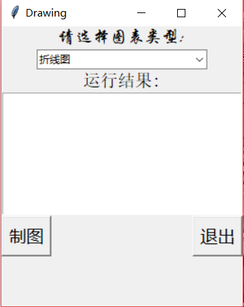
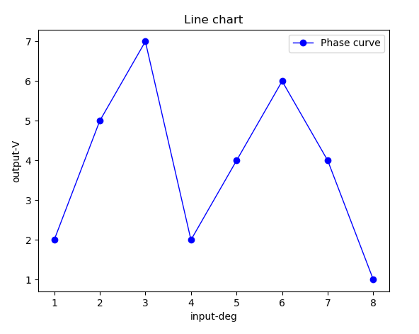
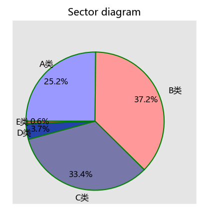
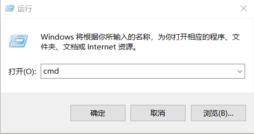
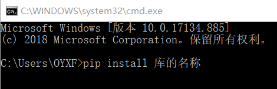

# 基于Python的简单制图工具
## 功能介绍
* 该简单制图工具是使用python语言编写的小程序。
* 该工具可以将excel文件中存储的数据提取，并按照使用者需求绘制成对应的图像，包括折线图、散点图、饼图和条形图。

## 工具特点
* 具有GUI交互界面，便于使用
* 可以生成多种类型图表
* 制图成功后，可导出图片文件
* 相较于excel自带制图功能，利用python制图，可调整性强，可以实现一些复杂的图表制作

## 环境配置
1. 直接点击.pyw文件打开GUI界面，可直接使用
2. 若使用.py文件运行，需安装python3.7.3运行程序
3. python3.7.3安装完毕后，需安装相应的库，包括xlrd，os，matplotlib，openpyxl，tkinter
4. 库的安装方法为：在运行中输入cmd，在打开窗口中使用pip install +库名称进行安装

## 注意事项
* 往excel中导入数据时，需按照一定的规范
* 图片默认储存路径为D:\description，可创建该文件夹，或在代码中修改存储位置
